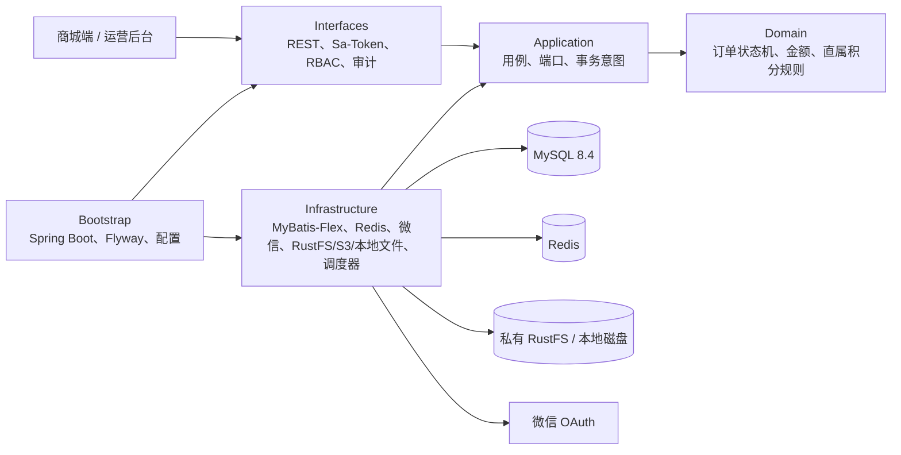
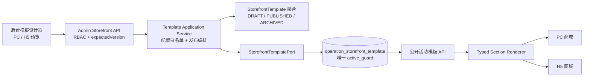
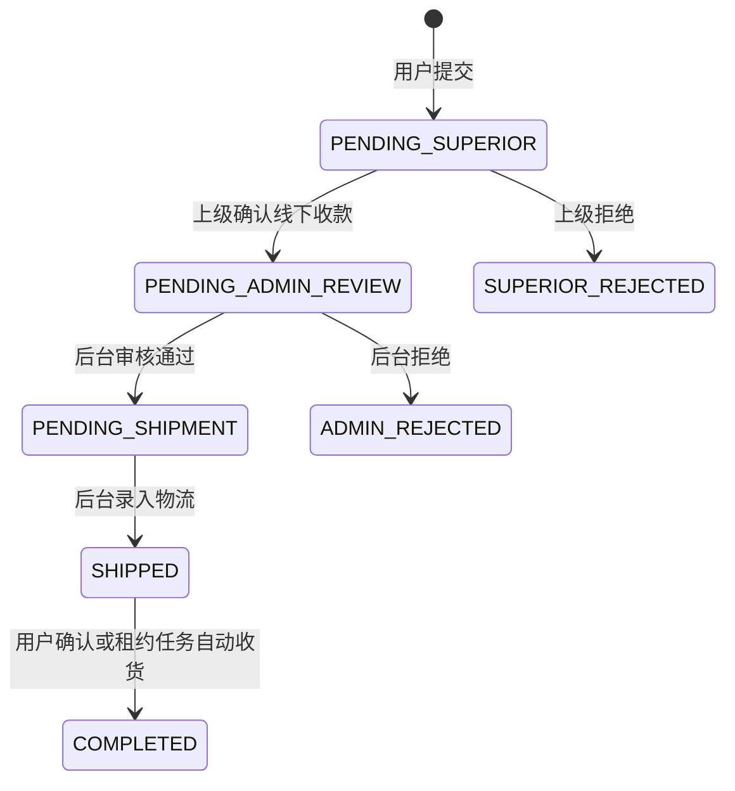
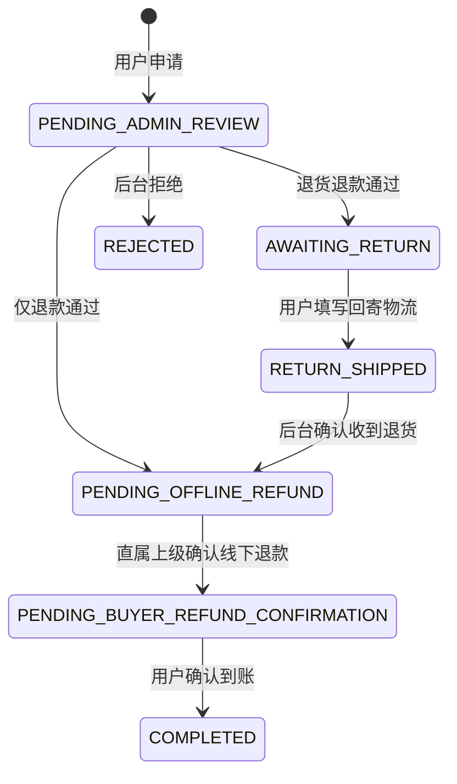

# 架构与核心业务

## 模块与依赖方向

领域层不依赖 Spring、数据库或网络。应用层通过端口表达身份、交易、会员、售后和存储意图；基础设施层实现端口；接口层只负责协议、会话和权限。

## 多模板商城上下文

商城模板是独立的 `storefront` 业务上下文：领域聚合维护草稿、发布、归档和“生效模板不可直接编辑”的状态约束；应用服务校验主题令牌与白名单区块、处理乐观版本；MyBatis 适配器在一个事务中取消旧模板并激活新模板；接口层分别提供公开只读投影和带 `storefront:template:manage` 权限的后台命令。

模板只保存受控 JSON：全局颜色、圆角、标题字体和最多 24 个有序区块。区块类型固定为公告、主视觉、分类导航、商品集合、内容故事、服务权益和快捷入口；不会保存或执行任意 Vue、JavaScript、CSS 或 HTML。公开读取始终只暴露唯一生效版本，没有活动行时降级到应用内置的编辑甄选模板。三套预设共享商品、内容、分类和会员能力，只在布局与视觉语言上区分。

## 订单状态机

提交时按客户端请求号幂等，库存从可售转入预占；上级或后台拒绝时返还预占；发货时消耗预占；所有更新使用订单版本号做乐观并发控制。

## 会员与积分投影

每次订单状态变化与业务事务同时写入 `sys_outbox_event`。后台投影器通过 `FOR UPDATE SKIP LOCKED` 领取事件，并将消费结果写入 `sys_inbox_event`，同一事件对同一消费者只处理一次。

完成订单按生效规则版本执行：

1. 符合升级场景与金额时写入 `membership_evidence`，等级只向更高 rank 迁移。
2. 被邀请人达到超级会员且订单符合直属任务时，为直属上级写一条 `distribution_direct_performance`。
3. 前 5 位有效直属用户只计算分红会员资格。
4. 第 6 位起为直属上级写入 A 池可用积分与 B 池冻结积分。演示默认分别为 160。
5. 会员自己的复购订单符合规则时，以不可变账本分录将 B 池积分释放到 A 池。

硬安全边界不进入动态规则：在线支付关闭、积分不能提现/转账/兑现金、最大关系深度为 1。

## 售后冲正

售后完成后发出 `AFTERSALE_COMPLETED`：

- 原账本分录不修改，追加带 `original_entry_id` 的反向分录。
- 关联升级证据标记 `INVALID`。
- 关联直属业绩标记 `REVERSED`。
- 买家和受益人等级根据仍有效证据与业绩重新计算。

## 凤凰架构约束

- **Forward migration**：Flyway 只增加新版本，不编辑已执行迁移。
- **Retryable delivery**：outbox/inbox、唯一幂等键和事务回滚支持安全重试。
- **Immutable facts**：账本、会员证据、业绩和审计记录保留历史，通过状态或反向记录纠正。
- **Leases**：自动收货使用 `sys_job_lease`，多实例只有租约所有者运行批处理。
- **Graceful degradation**：微信关闭时给出明确错误；付款凭证失败不影响既有订单；投影失败保留 PENDING 事件等待重试。
- **Observability**：Actuator 健康检查、请求号、后台审计、Flyway 历史和 outbox 状态提供运行证据。

## 私有付款凭证

允许 JPG、PNG、WebP，单文件默认最大 8MB，每订单默认最多 3 个，数量、大小和保存期限均由版本化规则配置。服务端校验文件魔数与图片完整性，JPEG/PNG 会解码后重新编码，WebP 会移除 EXIF/XMP/ICCP 元数据。对象键、SHA-256、媒体类型、大小、上传人和保留期写入数据库；下载接口先校验订单参与人或后台权限，再由当前存储提供者生成短时访问地址。`s3` 模式通过 AWS SDK v2 签发 path-style S3 URL；`local` 模式签发包含到期时间与 HMAC 的应用内 URL，并在读取前验证签名、过期时间和安全根目录。所有下载和删除均写入审计，数据库写入失败时尝试删除已上传对象，到期文件由带租约的清理任务安全重试。

## 运营后台闭环

运营后台路由、菜单和操作按钮使用同一组 RBAC 权限码，后端仍在每个接口重复授权。订单与售后详情在需要时加载快照、时间线、内部备注和凭证元数据；凭证只在点击查看时签发短时地址。

商品和内容图片复用图片安全清洗器，可存入 RustFS 私有 bucket 或应用受限本地目录，但始终通过 `/api/v1/catalog/assets/{id}` 由应用提供稳定的公开读取地址，不暴露 RustFS 主机、bucket、对象键或真实磁盘路径。商品支持多 SKU，库存调整继续写入幂等流水。

退货地址和低库存阈值保存在 `operation_setting`，订单/售后时限与凭证限制继续通过不可变 `ORDER_TIMERS` 规则版本管理。账号、角色、设置、素材与规则写操作均记录真实管理员和变更原因；自定义角色只有在未分配给账号时才能删除。
